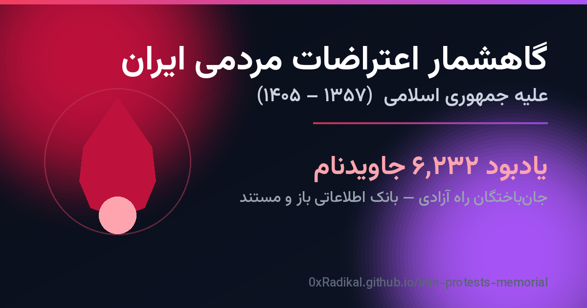

<div align="center">

# گاهشمار اعتراضات مردمی ایران و یادبود جاویدنام‌ها
### Iran Protests Timeline & Javidnam Memorial Archive

[](https://0xradikal.github.io/iran-protests-memorial/)
[](https://0xradikal.github.io/iran-protests-memorial/javidnam.html)
[](https://0xradikal.github.io/iran-protests-memorial/)
[](https://creativecommons.org/licenses/by/4.0/)
[](./LICENSE)

**[🌐 مشاهده وب‌سایت / Live Site](https://0xradikal.github.io/iran-protests-memorial/)** · **[🕯️ جاویدنام‌ها / Memorial](https://0xradikal.github.io/iran-protests-memorial/javidnam.html)** · **[📊 دادهٔ باز / Open Data](#-دادهٔ-باز--open-data)**



</div>

---

## 🇮🇷 فارسی

### دربارهٔ پروژه

این یک **آرشیو باز، مستند و تعاملی** است که در دو بخش گردآوری شده:

1. **گاهشمار اعتراضات مردمی ایران** — مرور بیش از **۴۰ اعتراض، خیزش، اعتصاب و حرکت نمادین** مردمی علیه جمهوری اسلامی، از انقلاب ۱۳۵۷ تا خیزش‌های ۱۴۰۵.
2. **یادبود جاویدنام‌ها** — بانک اطلاعاتی **۶٬۲۳۲ جان‌باخته، اعدام‌شده و ناپدیدشدهٔ** راه آزادی ایران؛ نام تک‌تک آنان، تا حد امکان با شرح، شهر، تاریخ و منبع.

> **اصل بنیادین:** این یادبود **تنها** شامل جان‌باختگان از میان مردم و در کنار مردم است و **هیچ‌گاه** نیروهای حکومتی، بسیج یا سازمان‌های سرکوبگر را در بر نمی‌گیرد.

### امکانات

- ⏳ گاهشمار بصری تعاملی با جستجو و فیلتر بر اساس دهه و دسته
- 🕯️ بانک اطلاعاتی جاویدنام‌ها با جستجو، فیلتر بر اساس رویداد و سطح اعتبار، و صفحه‌بندی
- 🔎 جستجوی زندهٔ نام، شهر، استان و شغل
- 📂 دستهٔ داده‌ها در **۱۲ رویداد** (کوی دانشگاه ۷۸ تا خیزش ۱۴۰۴)
- ✅ دو سطح اعتبار: **مستند** و **گزارش‌شده**
- 📥 دادهٔ باز قابل دانلود در قالب‌های JSON، JSON فشرده، CSV و JSON Schema
- 🎨 طراحی واکنش‌گرا، راست‌چین فارسی، تم تاریک، فونت Vazirmatn
- 🚀 SEO پیشرفته: Open Graph، Twitter Card، JSON-LD، sitemap، robots و PWA manifest

### راهنمای سریع

| صفحه | نشانی |
|------|-------|
| گاهشمار | [`index.html`](https://0xradikal.github.io/iran-protests-memorial/) |
| جاویدنام‌ها | [`javidnam.html`](https://0xradikal.github.io/iran-protests-memorial/javidnam.html) |

---

## 🇬🇧 English

### About

An **open, documented, interactive archive** in two parts:

1. **Iran Protests Timeline** — 40+ popular protests, uprisings, strikes and symbolic acts against the Islamic Republic, from the 1979 revolution to the 2026 uprisings.
2. **Javidnam Memorial** — an open database of **6,232 people** killed, executed or disappeared on the path to Iran's freedom; each name documented, where possible, with story, city, date and source.

> **Core principle:** this memorial includes **only** those killed *among* and *alongside* the people. It **never** includes regime forces, Basij, or repressive organizations.

### Features

- Interactive visual timeline with search & decade/category filters
- Searchable, filterable, paginated memorial database
- Live search across name, city, province, occupation
- 12 event categories, two verification levels (documented / reported)
- Open data downloads: JSON, minified JSON, CSV, JSON Schema
- Responsive RTL dark UI with the Vazirmatn font
- Advanced SEO: Open Graph, Twitter Cards, JSON-LD, sitemap, robots, PWA manifest

---

## 📊 دادهٔ باز / Open Data

تمام داده‌ها در پوشهٔ [`assets/data/`](./assets/data/) و به‌صورت باز در دسترس‌اند:

| فایل / File | توضیح / Description |
|------|------|
| [`javidnam.json`](./assets/data/javidnam.json) | بانک کامل جاویدنام‌ها — `{metadata, events, people}` |
| [`javidnam.min.json`](./assets/data/javidnam.min.json) | نسخهٔ فشردهٔ JSON |
| [`javidnam.lite.json`](./assets/data/javidnam.lite.json) | نسخهٔ سبک (فیلدهای کوتاه) برای نمایش وب |
| [`javidnam.csv`](./assets/data/javidnam.csv) | خروجی CSV با BOM (سازگار با اکسل فارسی) |
| [`by-event/*.json`](./assets/data/by-event/) | فایل جداگانه برای هر یک از ۱۲ رویداد |
| [`statistics.json`](./assets/data/statistics.json) | آمار محاسبه‌شده |
| [`person.schema.json`](./assets/data/person.schema.json) | طرح‌وارهٔ JSON Schema (Draft 2020-12) |
| [`protests.json`](./assets/data/protests.json) | داده‌های گاهشمار (۴۰ رویداد) |

### ساختار رکورد جاویدنام / Javidnam record schema

```json
{
  "id": "jvn_4303520495",
  "slug": "...",
  "name": "نام فارسی",
  "name_en": "English name",
  "event": "khizesh_1401",
  "gender": "مرد | زن | null",
  "age": 22,
  "birth_year": 1379,
  "date_jalali": "۱۴۰۱/۰۷/۰۲",
  "date_gregorian": "2022-09-24",
  "city": "شهر",
  "province": "استان",
  "cause": "شرح جان‌باختن",
  "occupation": "شغل",
  "story": "زندگی‌نامهٔ کوتاه",
  "story_en": "Short biography",
  "photo_url": null,
  "memorial_links": [],
  "notable": false,
  "verification": "documented | reported",
  "sources": ["..."]
}
```

---

## 🛠️ فناوری / Tech Stack

- **HTML5 + TailwindCSS (CDN) + Vanilla JavaScript** — کاملاً استاتیک، بدون نیاز به بیلد
- **GitHub Pages** برای میزبانی
- **GitHub Actions** برای استقرار خودکار
- فونت **Vazirmatn** و آیکون‌های **Font Awesome**

این سایت **کاملاً استاتیک** است و هیچ سرور یا بک‌اندی ندارد؛ کافی است فایل‌ها را روی هر میزبان استاتیک قرار دهید.

### اجرای محلی / Run locally

```bash
git clone https://github.com/0xRadikal/iran-protests-memorial.git
cd iran-protests-memorial
python3 -m http.server 8080   # سپس http://localhost:8080
```

---

## 📚 منابع / Sources

داده‌ها بر پایهٔ منابع حقوق بشری و رسانه‌های مستقل گردآوری شده‌اند:
عفو بین‌الملل (Amnesty International)، مجموعه فعالان حقوق بشر در ایران (هرانا/HRANA)،
سازمان حقوق بشر ایران (IHRNGO)، مرکز اسناد حقوق بشر ایران (IranHRDC)،
BBC فارسی، دویچه‌وله، صدای آمریکا (VOA)، رادیو فردا، رادیو زمانه، ویکی‌پدیا و گزارش‌های سازمان ملل.

---

## 🤝 مشارکت / Contributing

این یک پروژهٔ زنده و در حال تکمیل است. برای افزودن یا اصلاح نام‌ها، گزارش خطا یا بهبود، لطفاً [`CONTRIBUTING.md`](./CONTRIBUTING.md) را ببینید و یک Issue یا Pull Request باز کنید.

## 📄 پروانه / License

- **کد**: [MIT](./LICENSE)
- **داده و محتوا**: [CC BY 4.0](https://creativecommons.org/licenses/by/4.0/) — استفاده آزاد با ذکر منبع.

---

<div align="center">

این سند صرفاً جنبهٔ **آموزشی، تاریخی و مستندسازی حقوق بشری** دارد.
نام‌ها با احترام و تنها برای حفظ یاد و حقیقت گردآوری شده‌اند.

*«نام‌شان جاوید، یادشان گرامی.»*

</div>
